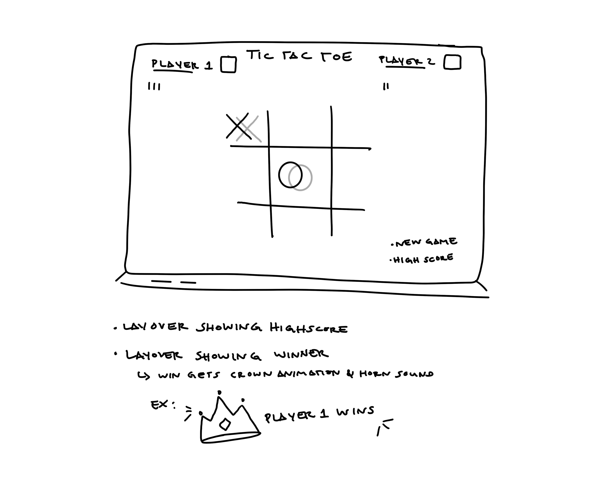

# tictactoe_project1
Tic Tac Toe Project for Interapt Immersive Bootcamp

Link to game: https://kairoje.github.io/tictactoe_project1/

Technologies used: HTML, CSS, Javascript

## Wireframe:

## Goals:
### MVP Bronze:

- Simple layout with lines creating a nine square grid
- Each player is assigned either “X” or “O”
- Can click a grid position
- Highlight winner

### Silver:

- ~~Add tally mark to player for each win~~ 
- ~~Add high score~~ 
- ~~Randomize marker selection~~
- Green background in playing field
- White text color

### Gold:

- Change text style to match chalk
- ~~Layover screen to display high score when button is clicked~~
- Layover screen to display winner (maybe a trumpet sound)
- ~~Play against computer~~
- ~~Add hover to grid~~

## Planning:

*HTML*
    - Body
    - A section holds title, grid, player1 & 2, X & O
    - H1 element for "Tic Tac Toe"
    - A span/div for the grid holding the game squares

*CSS*
    - Grid for title and player => player Title player layout, center
        *3 columns 2 rows
    - Grid for game squares center page

*Javascript*
    - create a variable:
        for each of the squares
        for the player text
        for new game "button"
        winning rules
        array containing empty strings to correlate with empty square
        current player
        to tell whether the game is going or not

    - create a function:
        to start the game => logic: loop through each square listening for a click, also have new game button listen for a click, begin with text saying who's turn it is, make game run

        to check for whether or not a square has been clicked => logic: create a cell index variable, determine whether or not a square is empty, only allow squares to be clicked while game is running. If a square is clicked mark it with the current players mark, check for a winner.

        to switch between players => logic: if currentPlayer is "X" then update to player "O" otherwise currentPlayer should update to player "X"

        to check to see if theres a winner => logic: set a variable to check wether or not a round bas been won.
        Loop through the array of win rules, set a variable to hold a win rule array index. Create variables to hold each one of the indicies that lead to a win. If those square indicies are empty checking for a winner can be skipped, if any of the rule indicies are matched current player is the winner. If the current player is a winner highlight player text and end the game, and if all the square are filled and there is no winner then game is a draw. Otherwise switch players

## Tic Tac Toe Draft 1(Final):

This tic tac toe project consist of a title, game status, game board, and a new game button to reset the board. There are two players: X & O, and only one player is allowed to click and fill a sqaure per round. If a player's symbol has three marks in a row in any direction, that player will be declared as the winner. If each square has a symbol but none are three in a row, a draw game will be declared. If a player wants to restart the game, the new game button can be clicked to refresh the game. This button can also be pressed at any moment if necessary. When either player wins a victory sound will play, if there's a draw game a sound indicate so.

## Coding details:

The "Winning" Solution:

Finding the winning logic was the most trying issue I needed to solve during this project. I started with a 2 dimensional array, whose inner arrays hold various combinations that indicate a win. I started with multiple if, and else if statements to determine which combo was present on the grid (game board). I then tried using a for and forEach loop to pull each index out and associate the indicies with the squares. That logic was creating an issue with the click logic and displayed a win whenever any square was clicked. After reading more documentation on various loops, I gave the for of loop a shot, created an array as a variable, and was able to better associate that array with the indicies of the squares. The win function is also only functional after at least five clicks are on the board, since a player would need at least 3 turns to win, and after a turn from the other player. If any of the combos were matched a win boolean is activated and the game board deactivates.

From there the draw option was created by using a clicks logic. If there are nine clicks on the board and the win boolean isn't activated, it is assumed that no win combos were matched. The game board is then deactivated and "draw" is displayed. 

## Getting Everything Centered:

I struggled with getting the board centered to mimic a classroom chalk board. I was toggling between the body dimensions and the chalkboard container. I have my best solution so far by adjusting the min and max-width of the chalkboard. From there I made the chalkboard a flex container and centered the content within it.

## Sources:

Help with removing outter borders from game grid: 
https://stackoverflow.com/questions/19339578/a-grid-of-boxes-with-no-outer-border-but-with-all-inner-borders

Documentation on loops(assisted with finding a loop for win logic):
https://www.w3schools.com/js/js_loop_for.asp
https://www.freecodecamp.org/news/javascript-loops-explained-for-loop-for/

Fonts:
https://www.cdnfonts.com/

Documentation for audio on click:
https://stackoverflow.com/questions/18826147/javascript-audio-play-on-click

Sound effects:
https://mixkit.co/

    
    
